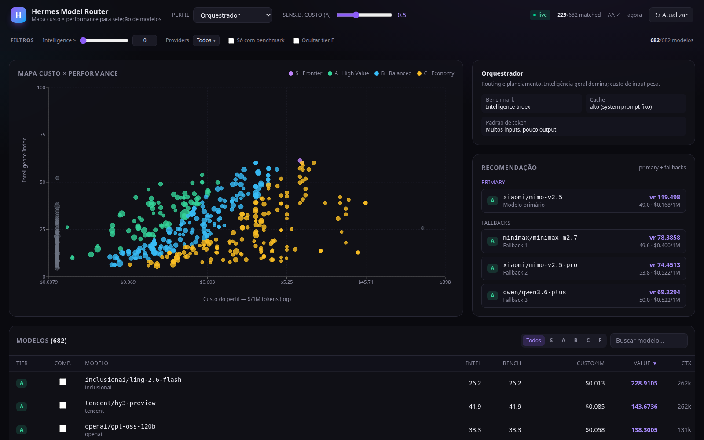

# Hermes Model Router — Models Monitor

[](https://github.com/marcos-scalabrin/models-monitor/actions/workflows/ci.yml)
[](./LICENSE)
[](https://www.python.org)
[](https://nodejs.org)
[](#arquitetura)

Mapa de **custo × performance** de LLMs para ajudar agentes a escolher o modelo
certo para cada tarefa. Cruza benchmarks da **Artificial Analysis** com preços
reais do **OpenRouter**, classifica os modelos em tiers por perfil de agente e
expõe tudo via API (para agentes) e um dashboard (para humanos).



> Especificação conceitual completa em [`hermes-model-router.md`](./hermes-model-router.md).
> Itens em aberto em [`BACKLOG.md`](./BACKLOG.md).

## O que faz

- **Coleta** modelos do OpenRouter (preços, contexto, capacidades) e da
  Artificial Analysis (Intelligence / Coding / Math index, GPQA, HLE, …).
- **Cruza** as duas fontes por modelo, com normalização de creator + matching
  por token-set (resolve `anthropic/claude-opus-4.7` ↔ `Claude Opus 4.7`).
- **Pontua** cada modelo por *perfil de agente* (orchestrator, rag, coding,
  data, content, agentic, support) com uma função de custo específica e um
  `value_ratio = benchmark / custo^α`.
- **Classifica** em tiers **S** (frontier) / **A** (high value) / **B**
  (balanced) / **C** (economy) / **F** (filtrado).
- **Recomenda** modelo primário + fallbacks por perfil — o endpoint que um
  agente consome para rotear/escolher modelos.

## Arquitetura

```
backend/   FastAPI — fetch → join → score → tiers → API (uv)
frontend/  React + Vite + TS + Tailwind v4 + Recharts (dark dashboard)
```

Dashboard: mapa custo×performance, tabela ordenável (clique nos cabeçalhos),
busca, e barra de filtros (Intelligence ≥ X, provider, só-com-benchmark,
ocultar tier F) que afeta o mapa e a tabela. Backend serve na porta **8890**.

| Camada | Arquivo |
|---|---|
| Fontes de dados | [`backend/app/sources/`](backend/app/sources/) |
| Join AA ↔ OpenRouter | [`backend/app/join.py`](backend/app/join.py) |
| Perfis + funções de custo | [`backend/app/profiles.py`](backend/app/profiles.py) |
| Scoring + tiers | [`backend/app/score.py`](backend/app/score.py) |
| Regras de cache por provider | [`backend/app/cache_rules.py`](backend/app/cache_rules.py) |
| Cache em memória + TTL | [`backend/app/store.py`](backend/app/store.py) |
| API | [`backend/app/routes.py`](backend/app/routes.py) |

## Como rodar

### Backend

```bash
cd backend
cp .env.example .env          # cole sua AA_API_KEY para dados reais da AA
uv sync
uv run uvicorn app.main:app --reload --port 8890
```

- OpenRouter é público (sem key). A **Artificial Analysis** exige `AA_API_KEY`.
- Sem a key (ou com `USE_FIXTURES=true`), o backend serve fixtures embarcadas
  ([`backend/app/data/`](backend/app/data/)) para funcionar offline.
- Docs interativas (OpenAPI): http://127.0.0.1:8890/docs

### Frontend

```bash
cd frontend
npm install
npm run dev                   # http://localhost:5173 (proxy /api -> :8890)
```

## API (consumida por agentes)

| Método | Rota | Descrição |
|---|---|---|
| `GET` | `/api/recommend?profile=coding&top=3` | **Núcleo:** primário + fallbacks para um perfil |
| `GET` | `/api/models?profile=…&tier=A&sort=value_ratio` | Modelos pontuados + filtros |
| `GET` | `/api/models/{id}?profile=…` | Detalhe de um modelo |
| `GET` | `/api/tiers?profile=…` | Modelos agrupados por tier |
| `GET` | `/api/cost-map?profile=…` | Pontos prontos para plotar (benchmark + custo) |
| `GET` | `/api/profiles` | Perfis de agente disponíveis |
| `GET` | `/api/meta` | Status: total/matched, modo (live/fixtures), última atualização |
| `POST` | `/api/refresh` | Força re-fetch das fontes |

Parâmetros comuns: `profile` (perfil de agente), `alpha` (sensibilidade ao
custo: `0` ignora custo, `0.5` raiz quadrada (default), `1` linear).

Em `/recommend`, há um piso de capacidade `min_intelligence` (default **48**):
todos os modelos retornados — primário e fallbacks — precisam ter Intelligence
Index acima desse valor. O agente passa o piso adequado pra tarefa (`48` filtra
os fracos; `60` exige frontier). Sem isso o ranking puro de `value_ratio` pode
indicar modelo baratíssimo mas incapaz como primário.

Exemplo:

```bash
curl "http://127.0.0.1:8890/api/recommend?profile=coding&top=2" | jq
```

```json
{
  "profile": "coding",
  "primary": { "id": "deepseek/deepseek-v4-flash", "tier": "A", "value_ratio": 129.3, "...": "..." },
  "fallbacks": [ { "id": "deepseek/deepseek-v3.2", "tier": "A", "...": "..." } ]
}
```

## Como o scoring funciona

Cada perfil tem uma função de custo (em [`profiles.py`](backend/app/profiles.py))
que reflete o padrão de uso do agente:

- **orchestrator / rag** → input domina: `input + 0.1·output + 0.05·cache_read`
- **coding / content** → output domina: `0.3·input + output`
- **agentic** → muitas chamadas, cache pesa: `input + output − savings_cache`
- **data / support** → balanceado: `0.5·input + 0.5·output`

`value_ratio = benchmark_do_perfil / custo^α`. Tiers são derivados por
percentil do `value_ratio` (A/B/C), com **S** = top-3 de Intelligence e **F** =
sem benchmark ou fora dos thresholds (`MAX_INPUT_COST_PER_1M`,
`MIN_INTELLIGENCE_SCORE`).

## Testes

```bash
cd backend && uv run pytest
```

Cobrem o join (matching, aliases de creator, dedup de variantes, modelos
não-matched) e o scoring (value_ratio, atribuição de tiers, efeito de α).

## Roadmap

Fases 1–2 da spec entregues (fetch, join, score por perfil, tiers, dashboard).
Próximos: export de `hermes_models.yaml`/`json`, diff de tiers entre coletas
(“modelo X subiu B→A”), e o agente de gestão de modelos por cima desta API.
